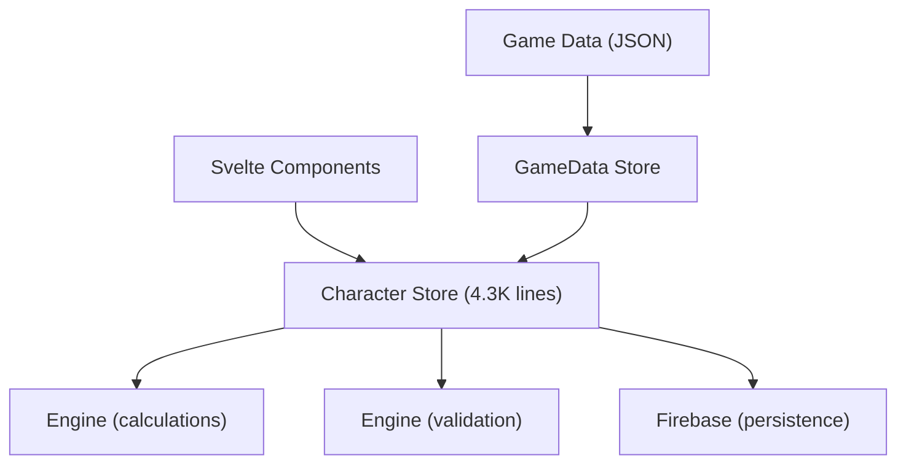

# ChummerWeb — Comprehensive Project Audit

> Performed 2026-03-08 against the full source tree at `f:\Projects\ChummerWeb`.

---

## 1. Executive Summary

ChummerWeb is a SvelteKit 2 / TypeScript web application reimplementing the Shadowrun 4th Edition character generator "Chummer." The project has **strong ambitions** documented in `REQUIREMENTS.md`, `CLAUDE.md`, and `README.md`—but the current implementation has significant gaps against those stated goals. The codebase shows solid domain knowledge and well-written business logic, but suffers from **architectural debt**, **missing infrastructure**, and **non-compliance with several of its own stated code-quality rules**.

| Area                          | Grade | Summary                                                                |
| ----------------------------- | ----- | ---------------------------------------------------------------------- |
| Architecture                  | ⚠️ C  | Monolithic character store (4,337 lines). No separation of concerns.   |
| Code Quality Rules Compliance | ❌ D  | Multiple stated rules are violated or unenforceable.                   |
| Test Coverage                 | ⚠️ C  | 10 test files exist with good logic, but nowhere near the claimed 80%. |
| Feature Completeness          | ⚠️ C+ | Core creation loop works; many requirements remain unimplemented.      |
| PWA / Offline Support         | ❌ F  | No service worker or manifest exists despite being a headline feature. |
| Security                      | ⚠️ C  | No Firestore rules in repo. Deprecated API usage.                      |
| DevOps / CI                   | ⚠️ C  | Docker configs have port mismatches. No CI pipeline found.             |
| Documentation                 | ✅ B+ | README, CLAUDE.md, REQUIREMENTS.md are thorough.                       |

---

## 2. Architecture Audit

### 2.1 The God Object: `character.ts` Store

> [!CAUTION]
> [character.ts](file:///f:/Projects/ChummerWeb/src/lib/stores/character.ts) is **4,337 lines** with **174 exported symbols**. This is a textbook "god object" anti-pattern.

This single file contains:

- Character creation wizard logic
- Metatype selection
- Attribute allocation and validation
- Quality management
- Skill management (individual, group, knowledge, specializations)
- Contact management
- Magic system (spells, powers, traditions, mentors, initiation, metamagics, spirits)
- Technomancer system (complex forms, submersion, echoes, sprites)
- Equipment management (weapons, armor, cyberware, bioware, vehicles, gear)
- Career mode advancement (karma spending, skill improvement, attribute improvement)
- Combat tracking (ammo, condition monitors, edge)
- Resource/nuyen management
- Martial arts
- Custom content
- All derived stores and constants

**Recommendation:** Split into domain-specific store modules:

- `stores/creation.ts` — Wizard, metatype, build method
- `stores/attributes.ts` — Attribute allocation and validation
- `stores/skills.ts` — Skills, groups, specializations, knowledge skills
- `stores/magic.ts` — Spells, powers, traditions, initiation, spirits
- `stores/technomancer.ts` — Complex forms, submersion, sprites, echoes
- `stores/equipment.ts` — Weapons, armor, gear, cyberware, bioware
- `stores/career.ts` — Career advancement, karma, expense log
- `stores/combat.ts` — Condition monitors, ammo, edge

### 2.2 Imports After Initial Lines

```typescript
// Line 3790 of character.ts
import type { BoundSpirit, CompiledSprite } from '$types';
```

Import statements appear mid-file (line 3790 of 4337). This violates standard TypeScript conventions and likely violates the ESLint `import/first` rule if enabled.

### 2.3 Engine Architecture

The `engine/` directory is well-structured:

- [calculations.ts](file:///f:/Projects/ChummerWeb/src/lib/engine/calculations.ts) (445 lines) — Derived values
- [validation.ts](file:///f:/Projects/ChummerWeb/src/lib/engine/validation.ts) (734 lines) — Build validation
- [improvements.ts](file:///f:/Projects/ChummerWeb/src/lib/engine/improvements.ts) (14KB) — Improvement system

However, much calculation logic is **duplicated in the store** rather than delegated to the engine.

### 2.4 Data Flow



The store acts as both state manager AND business logic layer. The engine exists but is underutilized—many calculations happen inline in the store.

---

## 3. Code Quality Rules Compliance

The project states these rules in [REQUIREMENTS.md](file:///f:/Projects/ChummerWeb/docs/REQUIREMENTS.md) (NFR-5):

| Rule                                        | Stated                  | Actual                                        | Status                   |
| ------------------------------------------- | ----------------------- | --------------------------------------------- | ------------------------ |
| NFR-5.1: Functions max 60 lines             | ✅ Configured in ESLint | ⚠️ Only for `.ts` files, NOT for `.svelte`    | Partially enforced       |
| NFR-5.2: Min 2 assertions per function      | ❌ Not enforced         | Not measured                                  | **Not enforced**         |
| NFR-5.3: No dynamic memory after init       | ❌ Not enforced         | Stores allocate on every update               | **Violated**             |
| NFR-5.4: All loops have fixed upper bounds  | ❌ Not enforced         | `.forEach`, `.map`, `.filter` used throughout | **Not applicable to JS** |
| NFR-5.5: All function return values checked | ❌ Not enforced         | Many `void` returns from store updates        | **Not enforced**         |
| NFR-5.6: TypeScript strict mode             | ✅ Enabled              | Full strict config in tsconfig.json           | ✅ **Compliant**         |
| NFR-5.7: Test coverage min 80%              | ❌ Not measured         | No coverage config, ~10 test files            | **Far from target**      |

> [!WARNING]
> Rules NFR-5.2 through NFR-5.5 appear to be copied from embedded/safety-critical coding standards (e.g., JPL, MISRA). They are **largely inapplicable** to a TypeScript/Svelte web application and should either be removed or replaced with web-appropriate alternatives.

### 3.1 ESLint Configuration Analysis

[eslint.config.js](file:///f:/Projects/ChummerWeb/eslint.config.js) enforces for `.ts` files:

- `max-lines-per-function: 60` ✅
- `complexity: 10` ✅
- `max-depth: 3` ✅
- `@typescript-eslint/no-explicit-any: error` ✅
- `@typescript-eslint/strict-boolean-expressions: error` ✅
- `@typescript-eslint/explicit-function-return-type: error` ✅

**Gap:** Svelte files only get `svelte.configs.recommended.rules` — none of the strict TypeScript or complexity rules. This means the large components ([EquipmentSelector.svelte](file:///f:/Projects/ChummerWeb/src/lib/components/wizard/EquipmentSelector.svelte) at 52KB, [CharacterSheet.svelte](file:///f:/Projects/ChummerWeb/src/lib/components/CharacterSheet.svelte) at 43KB) are unchecked.

### 3.2 TypeScript Configuration

[tsconfig.json](file:///f:/Projects/ChummerWeb/tsconfig.json) is **excellent** — one of the strictest possible configurations:

- `strict: true` + all individual strict flags
- `noUncheckedIndexedAccess: true`
- `exactOptionalPropertyTypes: true`
- `noUnusedLocals: true` / `noUnusedParameters: true`
- `noImplicitReturns: true`
- `allowUnreachableCode: false`

---

## 4. Test Coverage Audit

### Files Found (10 test files)

| File                                                                                                             | Lines | Area                                         |
| ---------------------------------------------------------------------------------------------------------------- | ----- | -------------------------------------------- |
| [character.test.ts](file:///f:/Projects/ChummerWeb/src/lib/stores/__tests__/character.test.ts)                   | 539   | BP, qualities, skills, contacts, nuyen, ammo |
| [character-creation.test.ts](file:///f:/Projects/ChummerWeb/src/lib/stores/__tests__/character-creation.test.ts) | ~500  | Character creation flow                      |
| [career-mode.test.ts](file:///f:/Projects/ChummerWeb/src/lib/stores/__tests__/career-mode.test.ts)               | ~500  | Career mode advancement                      |
| [equipment.test.ts](file:///f:/Projects/ChummerWeb/src/lib/stores/__tests__/equipment.test.ts)                   | ~500  | Equipment (store)                            |
| [equipment.test.ts](file:///f:/Projects/ChummerWeb/src/lib/types/__tests__/equipment.test.ts)                    | ~300  | Equipment (types)                            |
| [skills.test.ts](file:///f:/Projects/ChummerWeb/src/lib/types/__tests__/skills.test.ts)                          | ~100  | Skills (types)                               |
| [characters.test.ts](file:///f:/Projects/ChummerWeb/src/lib/firebase/__tests__/characters.test.ts)               | ~350  | Firebase CRUD                                |
| [dice.test.ts](file:///f:/Projects/ChummerWeb/src/lib/utils/__tests__/dice.test.ts)                              | ~?    | Dice rolling                                 |
| [exporter.test.ts](file:///f:/Projects/ChummerWeb/src/lib/xml/__tests__/exporter.test.ts)                        | ~?    | XML export                                   |
| [importer.test.ts](file:///f:/Projects/ChummerWeb/src/lib/xml/__tests__/importer.test.ts)                        | ~?    | XML import                                   |

### What's Missing

- **No tests for:** Engine calculations, engine validation, gamedata store, qualityBonuses, component rendering, route behavior
- **No E2E tests:** Playwright is a devDependency but no test files exist (`tests/` dir not found or empty)
- **No coverage reporting:** No `c8`, `istanbul`, or `vitest` coverage config
- **Target of 80% (NFR-5.7) is unreachable** with current test count

### Test Quality

The existing tests are **good quality** — they reference specific SR4 rulebook pages, test edge cases (clamping, limits, duplicates), and follow AAA pattern. The character store tests (539 lines) thoroughly cover BP management, quality costs, skill management, contact handling, nuyen conversion, and ammo tracking.

---

## 5. Feature Completeness vs Requirements

### FR Assessment Matrix

| Requirement Group          | Status             | Detail                                                                                                                                       |
| -------------------------- | ------------------ | -------------------------------------------------------------------------------------------------------------------------------------------- |
| FR-1: Authentication       | ✅ Mostly done     | Google sign-in implemented. Email/password (FR-1.2) missing. Anonymous use (FR-1.3) partially done.                                          |
| FR-2: Character Management | ✅ Mostly done     | CRUD, import/export, auto-save present.                                                                                                      |
| FR-3: Character Creation   | ✅ Done            | BP and Karma methods, metatype, attributes, qualities, skills, gear, contacts all functional.                                                |
| FR-4: Magic System         | ✅ Mostly done     | Adept, Magician, Mystic Adept, traditions, spells, powers, spirits, initiation, metamagics. Foci (FR-4.7) and mentor spirits partially done. |
| FR-5: Technomancer         | ✅ Mostly done     | Complex forms, submersion, echoes, sprites implemented.                                                                                      |
| FR-6: Equipment            | ✅ Mostly done     | Weapons, armor, gear, cyberware, bioware. Vehicles partially done.                                                                           |
| FR-7: Career Mode          | ⚠️ Partial         | Karma tracking, skill/attribute improvement, spells. Calendar (FR-7.9), street cred (FR-7.10) partially implemented.                         |
| FR-8: Sharing              | ❌ Not implemented | No sharing routes or UI exists.                                                                                                              |
| FR-9: Data Browser         | ⚠️ Partial         | Browse route exists but scope unclear.                                                                                                       |
| FR-10: Settings            | ❌ Not implemented | No settings route/component. House rules, source books, themes not implemented.                                                              |

### NFR Assessment Matrix

| Requirement            | Status                 | Detail                                                         |
| ---------------------- | ---------------------- | -------------------------------------------------------------- |
| NFR-1: Offline / PWA   | ❌ **Not implemented** | No service worker, no web manifest, no PWA support whatsoever. |
| NFR-2: Performance     | ❓ Unknown             | No performance testing or benchmarks.                          |
| NFR-3: Compatibility   | ⚠️ Partial             | Chummer XML import/export exists. Browser compat not tested.   |
| NFR-4: Security        | ⚠️ Partial             | No Firestore security rules in repo.                           |
| NFR-5: Maintainability | ⚠️ Partial             | See Section 3.                                                 |

---

## 6. Security Concerns

### 6.1 No Firestore Security Rules

There are no `firestore.rules` or `firebase.json` files in the repo. The `saveCharacter` function writes directly with no server-side validation. Any authenticated user could potentially write to any document if rules aren't configured externally.

### 6.2 Deprecated Firebase API

```typescript
// firebase/config.ts
import { enableIndexedDbPersistence } from 'firebase/firestore';
```

`enableIndexedDbPersistence` has been **deprecated** in Firebase v10 in favor of `persistentLocalCache` with `persistentMultipleTabManager`. This will generate console warnings and may break in future Firebase versions.

### 6.3 Client-Side Authorization Only

`verifyCharacterOwnership()` checks ownership client-side. Without Firestore security rules, this provides no real security — any API call could bypass it.

### 6.4 Missing Input Sanitization

Character data is saved directly to Firestore as-is. There's no Zod validation on save (despite Zod being listed as a dependency!). The `loadCharacter` function casts with `as Character` — no runtime validation.

---

## 7. DevOps / Infrastructure Audit

### 7.1 Docker Port Mismatch

| Config                                                                  | Port                 |
| ----------------------------------------------------------------------- | -------------------- |
| [Dockerfile](file:///f:/Projects/ChummerWeb/Dockerfile)                 | `EXPOSE 5173`        |
| [docker-compose.yml](file:///f:/Projects/ChummerWeb/docker-compose.yml) | `ports: "3000:3000"` |
| [vite.config.ts](file:///f:/Projects/ChummerWeb/vite.config.ts)         | `port: 3000`         |

The Dockerfile exposes port 5173 (Vite default) but the actual dev server runs on port 3000. The `EXPOSE` directive is cosmetic but misleading.

### 7.2 No CI/CD Pipeline

No `.github/workflows`, `Jenkinsfile`, `.gitlab-ci.yml`, or similar CI configuration found. Tests are not automatically run on push.

### 7.3 Unused Dependency

`dexie` (IndexedDB wrapper) is listed in `dependencies` but **never imported anywhere in the source code**. It's dead weight in the bundle.

### 7.4 Stale File

`temp_cyberware.xml` (133KB) sits in the project root. This appears to be a temporary conversion artifact that should be in `.gitignore` or deleted.

### 7.5 Mysterious `nul` File

A file called `nul` (72 bytes) exists at the project root. On Windows, this is a reserved device name which may cause issues on other platforms. It was likely created accidentally (e.g., redirecting output to `nul` on Windows).

---

## 8. Game Data Audit

18 JSON data files exist in `static/data/` totaling ~1MB:

| File             | Size  | Description          |
| ---------------- | ----- | -------------------- |
| weapons.json     | 268KB | Largest file         |
| vehicles.json    | 176KB | Full vehicle catalog |
| qualities.json   | 152KB | Quality definitions  |
| gear.json        | 71KB  | General gear         |
| spells.json      | 69KB  | Spell definitions    |
| cyberware.json   | 66KB  | Cyberware catalog    |
| armor.json       | 47KB  | Armor catalog        |
| metatypes.json   | 47KB  | Metatype definitions |
| bioware.json     | 39KB  | Bioware catalog      |
| skills.json      | 26KB  | Skill definitions    |
| powers.json      | 16KB  | Adept powers         |
| mentors.json     | 16KB  | Mentor spirits       |
| programs.json    | 9KB   | Matrix programs      |
| traditions.json  | 7KB   | Magic traditions     |
| echoes.json      | 5KB   | Technomancer echoes  |
| martialarts.json | 5KB   | Martial arts         |
| streams.json     | 2KB   | Technomancer streams |
| lifestyles.json  | 1KB   | Lifestyle costs      |

This is comprehensive data coverage. Scripts exist for XML-to-JSON conversion ([convert-xml-to-json.ts](file:///f:/Projects/ChummerWeb/scripts/convert-xml-to-json.ts), 32KB) and validation ([validate-chummer-data.ts](file:///f:/Projects/ChummerWeb/scripts/validate-chummer-data.ts), 27KB).

---

## 9. Positive Findings

Not everything is a problem — the project has real strengths:

1. **Domain expertise is deep.** The SR4 rules are implemented with precision, referencing specific book pages.
2. **TypeScript configuration is exemplary.** The strictest possible settings are enabled.
3. **Test quality is high.** Existing tests follow best practices with clear comments.
4. **Game data coverage is comprehensive.** 18 data files with conversion scripts.
5. **Error handling is consistent.** The `{ success, error }` result pattern is used throughout.
6. **XML import/export exists and is tested.** A critical feature for Chummer compatibility.
7. **Career mode has substantial implementation.** Karma advancement, initiation, submersion, spirits, sprites all have store functions.
8. **Engine separation exists.** Calculations and validation are in their own module, even if underutilized.
9. **Documentation is thorough.** Complete requirements spec, developer guidelines, and architecture docs.
10. **Build method flexibility.** Both BP and Karma creation methods supported with correct SR4 costs.

---

## 10. Priority Recommendations

### 🔴 Critical (Do First)

1. **Implement PWA infrastructure** — Add service worker and web manifest. Without these, the "Offline-First" headline claim in the README is false.
2. **Add Firestore security rules** — Add `firestore.rules` to the repository and deploy them. Client-side auth checks alone are insufficient.
3. **Replace deprecated `enableIndexedDbPersistence`** — Use `persistentLocalCache` with `persistentMultipleTabManager` before Firebase drops support.
4. **Add Zod validation on data load** — The `loadCharacter` function does `as Character` which is unsafe. Validate with the Zod schemas.

### 🟡 Important (Do Soon)

5. **Break up the character store** — Split the 4,337-line store into domain-specific modules. This is the single biggest maintainability improvement.
6. **Remove unused `dexie` dependency** — It's bundled but never used.
7. **Clean up stale files** — Remove `temp_cyberware.xml` and `nul` from the repo root.
8. **Fix Docker port mismatch** — Change Dockerfile `EXPOSE` from 5173 to 3000.
9. **Add test coverage reporting** — Configure `vitest` coverage and establish a baseline before the 80% target.
10. **Extend ESLint rules to Svelte files** — The largest components are completely unchecked by quality rules.

### 🟢 Should Do (When Possible)

11. **Add CI pipeline** — Automate lint + test on push.
12. **Revise NFR-5 rules** — Remove or replace embedded-systems rules (NFR-5.2–5.5) with web-appropriate equivalents.
13. **Implement missing features** — Character sharing (FR-8), settings (FR-10), E2E tests.
14. **Add component tests** — No Svelte component is tested. Consider `@testing-library/svelte`.
15. **Delegate store logic to engine** — Many calculations are inline in the store instead of using the engine modules.

---

## 11. Detailed File Metrics

| Path                                                  | Type      | Size  | Lines | Concern                            |
| ----------------------------------------------------- | --------- | ----- | ----- | ---------------------------------- |
| `src/lib/stores/character.ts`                         | Store     | 115KB | 4,337 | God object                         |
| `src/lib/utils/dice.ts`                               | Utility   | 53KB  | ?     | Unusually large for a dice utility |
| `src/lib/components/wizard/EquipmentSelector.svelte`  | Component | 53KB  | ?     | Very large component               |
| `src/lib/components/CharacterSheet.svelte`            | Component | 43KB  | ?     | Very large component               |
| `src/lib/components/wizard/QualitySelector.svelte`    | Component | 32KB  | ?     | Large component                    |
| `src/lib/scripts/convert-xml-to-json.ts`              | Script    | 32KB  | ?     | Conversion script                  |
| `src/lib/components/CareerAdvancement.svelte`         | Component | 28KB  | ?     | Large component                    |
| `src/lib/stores/gamedata.ts`                          | Store     | 23KB  | ?     | Acceptable                         |
| `src/lib/components/wizard/SkillAllocator.svelte`     | Component | 25KB  | ?     | Large component                    |
| `src/lib/components/wizard/AttributeAllocator.svelte` | Component | 25KB  | ?     | Large component                    |

---

_End of audit._
